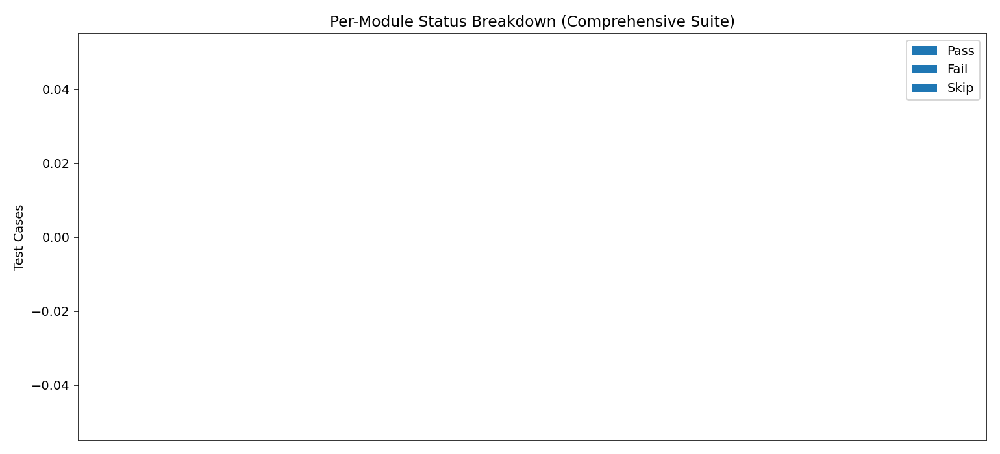
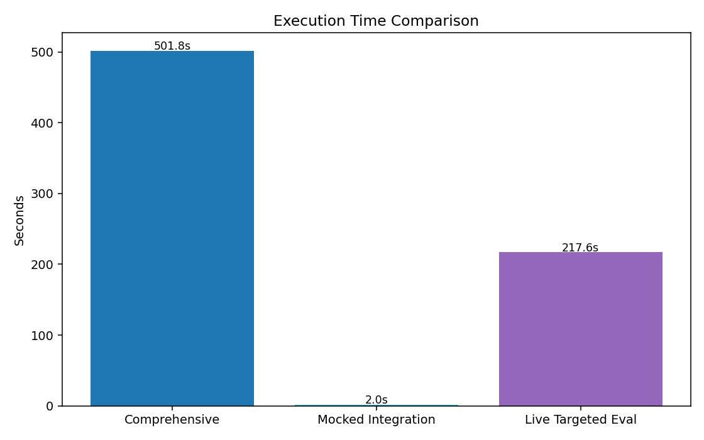
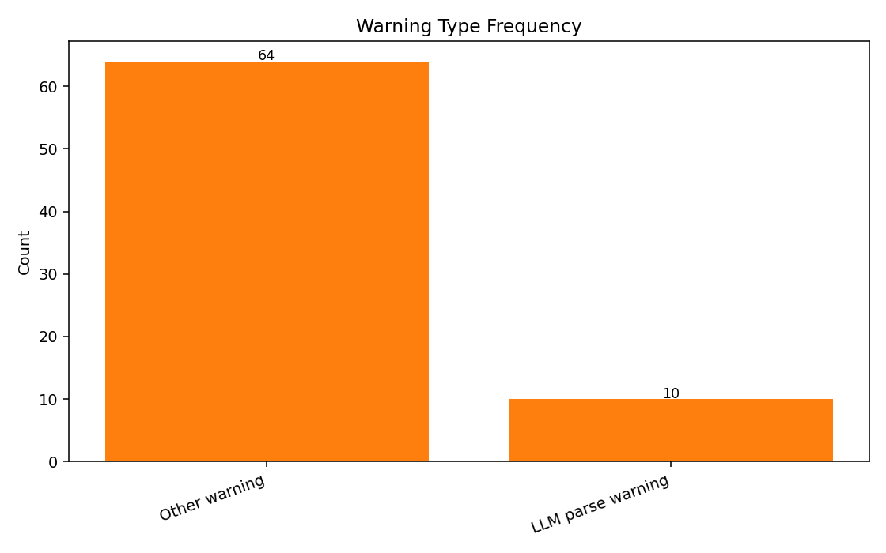
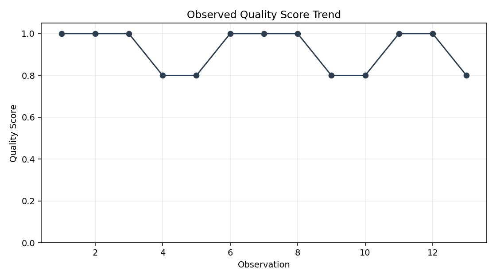
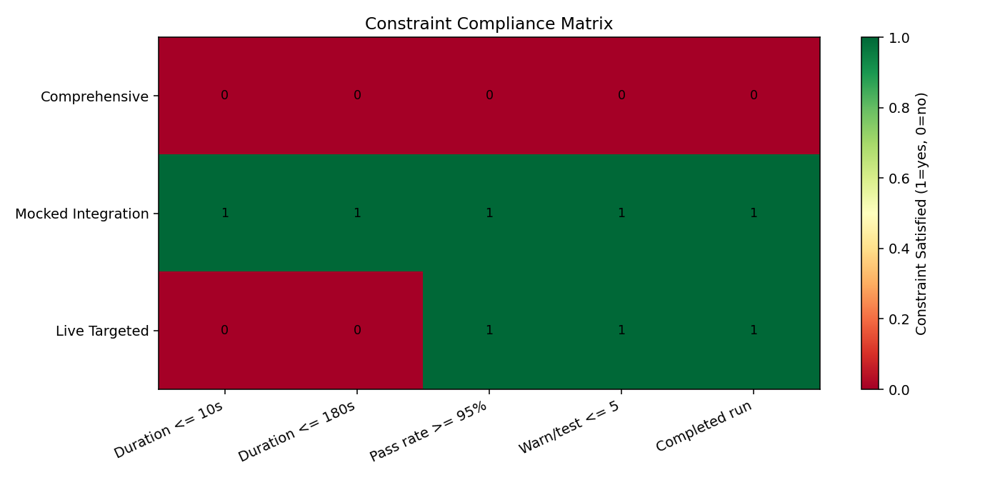
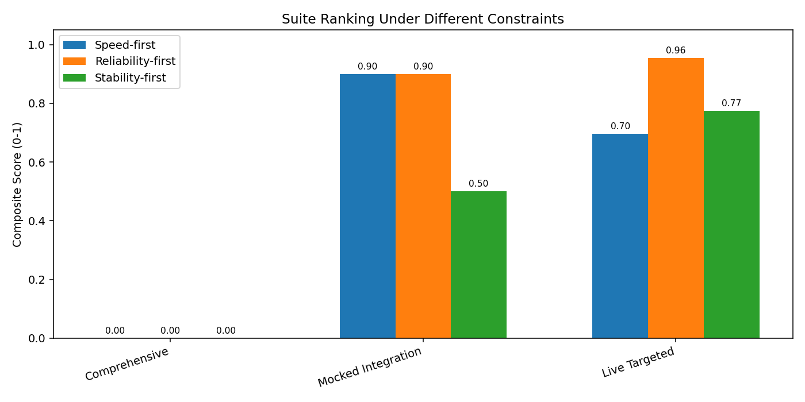

# Lumina Backend Evaluation Report

Generated: 2026-04-19 12:37:30

## Executive Summary

- Baseline comprehensive run: passed=0, failed=0, skipped=0, pass_rate=N/A.
- Mocked integration run (latest): passed=1, failed=0, warnings=5, duration=2.02s.
- Targeted live evaluator run (latest): passed=16, failed=0, warnings=36, duration=217.56s.

## Data Sources

- Comprehensive run source: `comprehensive_latest.log`
- Latest mocked integration run: `mocked_integration_latest.log`
- Latest targeted live eval run: `targeted_live_eval_latest.log`
- Partial comprehensive attempts:
- comprehensive_latest.log: incomplete, observed span ~501.8s
- comprehensive_latest2.log: incomplete, observed span ~286.1s

## Core Metrics

| Suite | Passed | Failed | Skipped | Warnings | Duration (s) |
|---|---:|---:|---:|---:|---:|
| Comprehensive (latest source) | 0 | 0 | 0 | N/A | 501.80 |
| Mocked Integration (latest) | 1 | 0 | 0 | 5 | 2.02 |
| Live Targeted Evaluators (latest) | 16 | 0 | 0 | 36 | 217.56 |

## Visualizations

### 1) Comprehensive Outcome Distribution

### 2) Per-Module Test Status Breakdown

### 3) Duration Comparison

### 4) Warning Type Frequency

### 5) Quality Score Trend

### 6) Constraint Compliance Matrix

### 7) Rankings Under Different Constraint Priorities

## Constraint Summary Table

| Suite | <=10s | <=180s | Pass>=95% | Warn/test<=5 | Completed |
|---|---:|---:|---:|---:|---:|
| Comprehensive | 0 | 0 | 0 | 0 | 0 |
| Mocked Integration | 1 | 1 | 1 | 1 | 1 |
| Live Targeted | 0 | 0 | 1 | 1 | 1 |

## Performance Interpretation

- Reliability: Comprehensive baseline completion summary is unavailable; mocked/targeted latest runs report zero failed tests.
- Robustness: Live evaluator logs still show occasional LLM JSON parse warnings, but tests pass due fallback handling.
- Throughput/latency: Mocked integration is fast (~2s), while targeted live evaluator checks are much slower (~177s), reflecting external LLM dependency overhead.
- Breadth vs repeatability: Current comprehensive sources appear incomplete and do not include a terminal summary, indicating long runs can terminate before full aggregation.

## Recommendations

1. Keep mocked integration in CI as a fast gate and run live targeted evaluator checks in scheduled pipelines.
2. Add explicit timeout/interrupt accounting to comprehensive runner so incomplete runs still emit machine-readable summary.
3. Track warning rate over time (especially parse/timeouts) as a stability KPI, not only pass/fail.